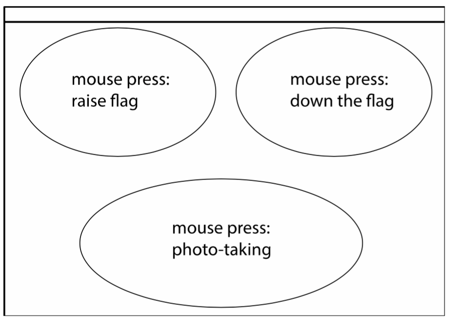
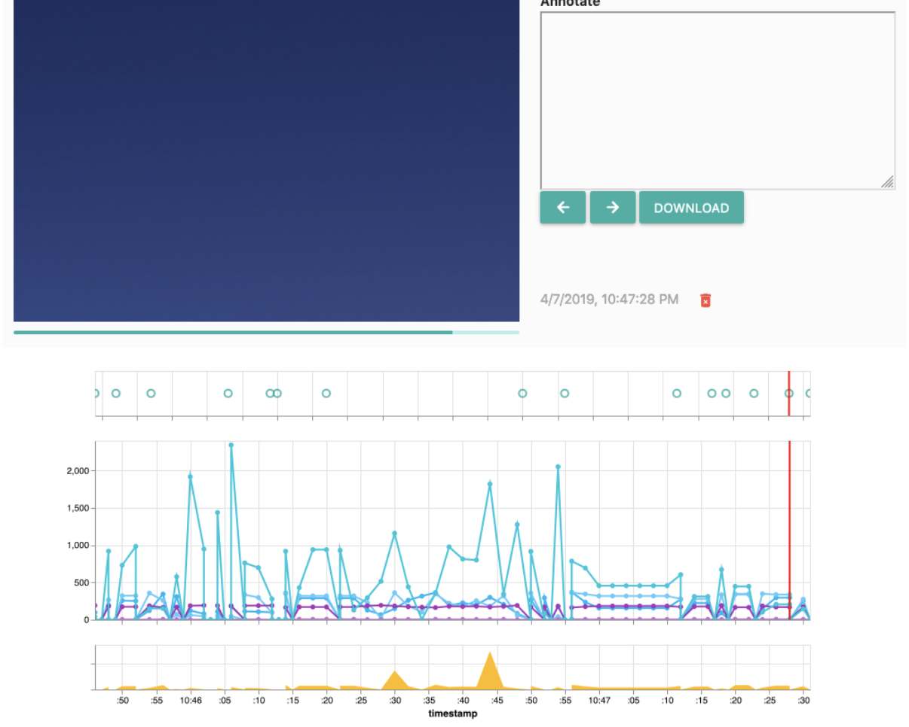

# ConnectedPeekabooToolkit

Connected Peekaboo Toolkit (CPT) is a design toolkit that design
researchers can use to conduct a design ethnographic research---
capturing photos and data for studying a specific context. Many examples
can be seen in the paper "Seeing through Things: Exploring Design Space
of Privacy-Aware Data-Enabled Objects". With the use of the CPT,
designers can build a connected system based on the solid foundation of
a working prototype with built-in connectivity, programmability (APIs),
and a data-sharing interface.

The CPT is built on an existing example, Peekaboo Camera
([https://github.com/FutureEveryday/PeekabooCam](https://github.com/FutureEveryday/PeekabooCam))
which is an automatic time-lapse camera with an interactive data control
button. The CPT turns the Peekaboo Camera into an open design, so that
designers can flexibly design its expression. We call the camera the CPT
camera in this paper. The CPT camera contains a Wifi router, which
allows design researchers to flexibly connect with multiple sensing
objects for wider data collection locally. The CPT camera also provides
data storage and an additional data sharing interface (Data Canvas),
which allows design researchers and participants to efficiently conduct
de-briefings all of the captured data.


## Publication

We publish this open-source design as a companion to the publication in the [ACM Transactions on Computer-Human Interaction (ToCHI)](https://dl.acm.org/journal/tochi). The paper is a great read/browse/ponder and introduces why we designed Connected Peekaboo Toolkit, how we did it and what the major results of deploying it were.


## Instructions

### 1. Prepare Materials

Follow steps in Peekaboo Cam ([https://github.com/FutureEveryday/PeekabooCam](https://github.com/FutureEveryday/PeekabooCam)) and prepare materials (you can remove button material).

**Electronic Materials (Peekaboo Cam)**

- Raspberry pi 3\*1
- Pi camera mini \*1
- Audio Amplifier 2x3W mini 5V PAM8403 \*1
- Speaker mini 0.5 w\*2
- Servo Motor DF9GMS \*2
- Mini Breadboard \*1
- SD card 16G \*1

**Code Materials**

- `Peekaboo_pi.img`
- `ESP_sensing_modules/module1/module1.ino`
- `ESP_sensing_modules/module2/module2.ino`
- `remote_control/peekaboo_datagen.pde`

### 2. Install image on your Raspberry Pi

**Step 1**

Download the operating system image `peekaboo_pi.img` to your computer.

**Step 2**

Insert a new SD card (the card will be fully erased!)

**Step 3**

Either use a program such as [Balena Etcher](https://www.balena.io/etcher/) to flash the image onto the SD card, or use Terminal or PuTTY and type:

````bash
sudo dd if=Desktop/peekaboo_pi.img of=/dev/disk2
````

_Note: Using the Terminal is risky, you need to know what you are doing!_


### 3. Follow the Building Steps in Peekaboo Cam

Follow the building steps in Peekaboo Cam ([https://github.com/FutureEveryday/PeekabooCam](https://github.com/FutureEveryday/PeekabooCam)) and remove 'button' function.


### 4. Start with Connected Peekaboo Toolkit

These steps teach you how to connect with the CPT and adjust the time
for the CPT. As such, you can remote control the CPT by entering the
code through terminal or PuTTY. Additionally you can make the CPT
capture the correct timestamps of the captured data and photos.

**Step 1**

Turn on the CPT.

**Step 2**

Searching & Connecting to the wifi, called ‘**Peekaboo**’ on your
Computer and enter the password: **boxeslittleboxes**

**Step 3**

Access to the Peekaboo from `terminal` on your computer (Mac/Linux), on Windows use **PuTTY** ([<u>https://www.putty.org</u>](https://www.putty.org)).

On Terminal or PuTTY, type

````bash
ssh pi@192.168.4.1
````

Enter the password: `raspberry`

**Step 4**

To ensure valid timestamps, adjust the time first from your computer, after doing step 2 and 3:

````bash
sudo date -s ‘2019-04-25 09:30:00’ # type the current date and time here
````

_Note: Every time you turn off the Pi, the time needs to be adjusted again._


### 5. Build Sensing Objects to Send Data to the CPT

The CPT enables a local connection between the CPT and the sensing
objects. The following steps teach you how to use additional ‘sensing
package’ to design your own sensing objects that can connect with the
CPT.

You need ESP32 boards to connect with the sensors you want and install the
boards to the object you make. Download the following files to the ESP
board and it will automatically send data to the CPT.

**Step 1**

Design sensing objects that can capture contextual data in supporting
your ethnographic study.

**Step 2**

Download the Sensing Package with two example programs for ESP32 based sensing modules, they are:
`ESP_sensing_modules/module1/module1.ino`
`ESP_sensing_modules/module2/module2.ino`

**Step 3**

Copy the file on the ESP32 board (using the Arduino IDE with the [OOCSI for ESP](https://github.com/iddi/oocsi-esp)
library installed). And then it will automatically send the data to the CPT.

The example code will only send random data to the CPT, your job is to 
connect sensors and send sensor data to the CPT.


### 6. Build Sensing Objects to Control the CPT

The CPT provides an Interaction API for design researchers to make their
sensing objects control the interaction of the CPT camera. In other
words, these steps teach you how to design a remote control function of
the CPT.

**Step 1**

Download the CPT remote control file: `remote_control/peekaboo_datagen.pde`

**Step 2**

Download Processing ([<u>http://processing.org</u>](http://processing.org)) and install the library ["OOCSI for Processing"](https://github.com/iddi/oocsi-processing), in Processing using the Processing library manager.

**Step 3**

Run the program. You can see a white canvas, and can press to control
the function:



**Step 4**

Copy the code labeled “trigger photo” or “raiseflag”, or “down flag” to
your ESP (sensing objects). Looking at the code that send the camera and
flag controls to the CPT, you can also design the trigger for the sensor
modules.


### 7. Access Data Canvas (make data visualisation)

After capturing data for a period of time, the CPT provides design
researcher's with a Data Canvas to automatically visualise data, and allows
them to annotate the data. To access Data Canvas, you need to follow the following steps:

**Step 1**

Connect your computer to Peekaboo Wifi, password: `boxeslittleboxes`

**Step 2**

Open Browser, access: [http://192.168.4.1](http://192.168.4.1)

**Step 3**

You can annotate the data, and even delete photos.

**Step 4**

Remember to 'download', otherwise it won't save your annotations and your data.



---

### How to Reset the CPT

You may need to reset the CPT after your testing. After reset the CPT,
you can start to conduct your study and capture data. The following
steps reset the data on the CPT:

**Step 1**

Use the program you have downloaded: `remote_control/peekaboo_datagen.pde`

**Step 2**

Uncomment the lines in the **setup** function.

**Step 3**

Run the program, which will reset the Peekaboo Cam.

**Step 4**

Comment the lines again, so you don't accidentally reset the Cam.

---

### A D V A N C E D

You can redesign, adapt and completely change the CPT behavior by changing the internally used Python scripts. **Only do this VERY carefully and only with basic knowledge of Python. Always make backups and take notes about your steps.**

#### Example: Re-design the behavior of the flag and the shutter block from the camera

**Step 1**

Connect to the Peekaboo wifi

**Step 2**

Access to the Peekaboo from terminal on your computer

````bash
ssh pi@192.168.4.1
````

Use password: `raspberry`

**Step 3**

In the home directory, type: 

````bash
nano timelapse/peekaboo.py
````

**Step 4**

You can find the code labeled by "shutter", "flag", you can edit the
number of the rotations of the servo motor.


---

_The above instructions have been provided without any warranties; we advise caution when following the steps._
